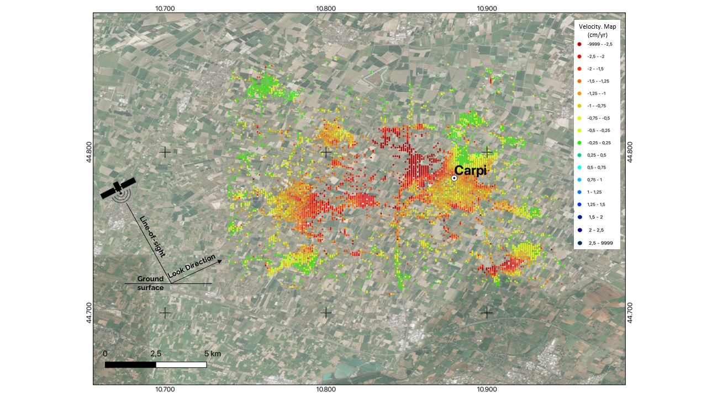
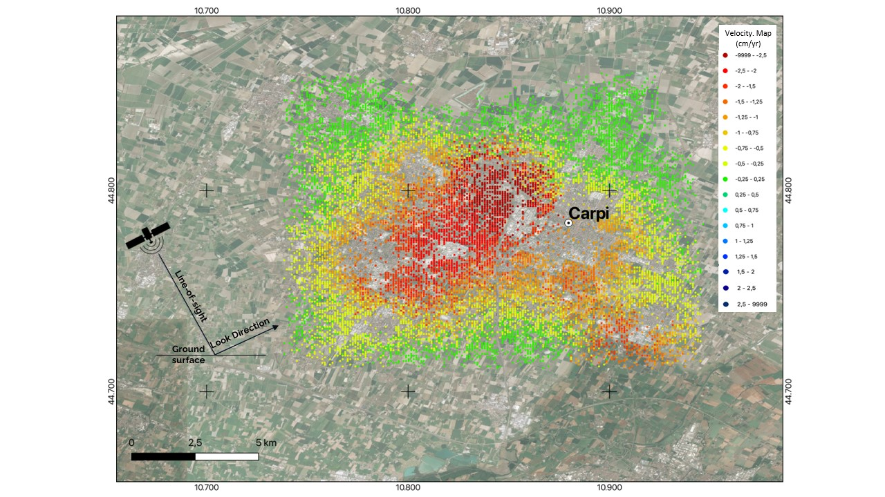

# cogsima2022

Repository for the paper [Enhancing Land Subsidence Awareness via InSAR Data and Deep Transformers]()

 | 
|:---:|:---:|
| input | output |

## Installation

### Clone and install the dependencies

```
git clone https://github.com/galatolofederico/cogsima2022.git
virtualenv --python=python3.8 env && . ./env/bin/activate
pip install -r requirements.txt
```

### Download dataset  

Download the shapefiles
```
wget http://131.114.50.176/owncloud/s/66EveoWWyvxd9BQ/download -O ./dataset.zip
unzip dataset.zip
```

Download and unzip `DEM-v1.1-E40N20` in `./dataset/dem` from [copernicus](https://land.copernicus.eu/imagery-in-situ/eu-dem/eu-dem-v1.1?tab=download)

Build the raster (it will require some time and at least `32G` of ram)
```
./build-raster.sh
```

If you want to re-split the dataset run
```
python -m scripts.split-dataset --data-folders ./dataset/raster/bologna-asc/ ./dataset/raster/bologna-dsc/ ./dataset/raster/pistoia-asc/ ./dataset/raster/pistoia-dsc/
```

### Download pre-trained models

To download the pre-trained models run

```
wget http://131.114.50.176/owncloud/s/C0XJcCLAps0513s/download -O ./models.zip
unzip models.zip
```

## Training

To train all the models run

```
./train-all.sh
```

To train a specific model run

```
python train.py --model <model> --train-batches 10000 --save
```

where model can be `encoderencoder` `vitencoder` `encoderdecoder` `vitdecoder`

## Evaluation

To run the inference on the testing set on all the models run

```
./predict-all.sh
```

To run the inference on the testing set on a specific model run

```
python predict.py --model <model-path> --points <input-points> --eval-batches 1000
```

To compute all the metrics and plots from the paper run

```
python evaluate.py
```

Results will be available in `./results`

## Prediction

To run the regression on all the missing data in a shapefile run
```
./predict-fill-shp.sh -m <model> -s <input-shapefile> -f <field-name> -o <output-shapefile> -n <montecarlo-steps>
```

## Contributions and license

The code is released as Free Software under the [GNU/GPLv3](https://choosealicense.com/licenses/gpl-3.0/) license. Copying, adapting and republishing it is not only allowed but also encouraged. 

For any further question feel free to reach me at  [federico.galatolo@ing.unipi.it](mailto:federico.galatolo@ing.unipi.it) or on Telegram  [@galatolo](https://t.me/galatolo)